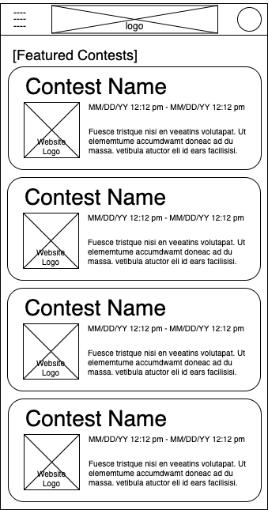
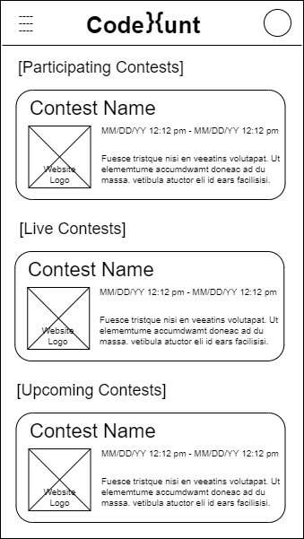
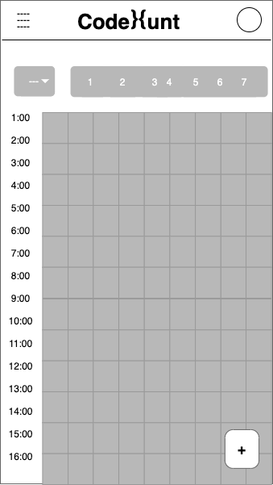
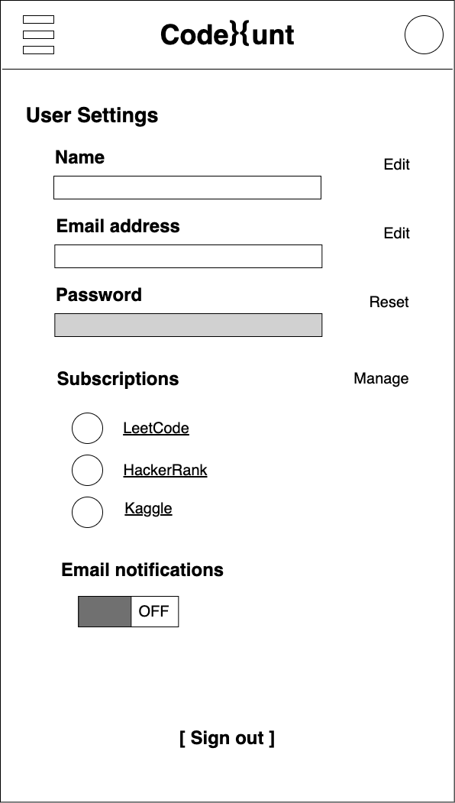
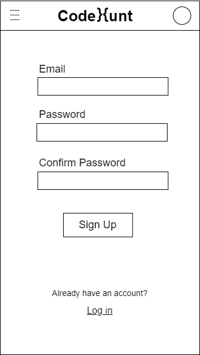
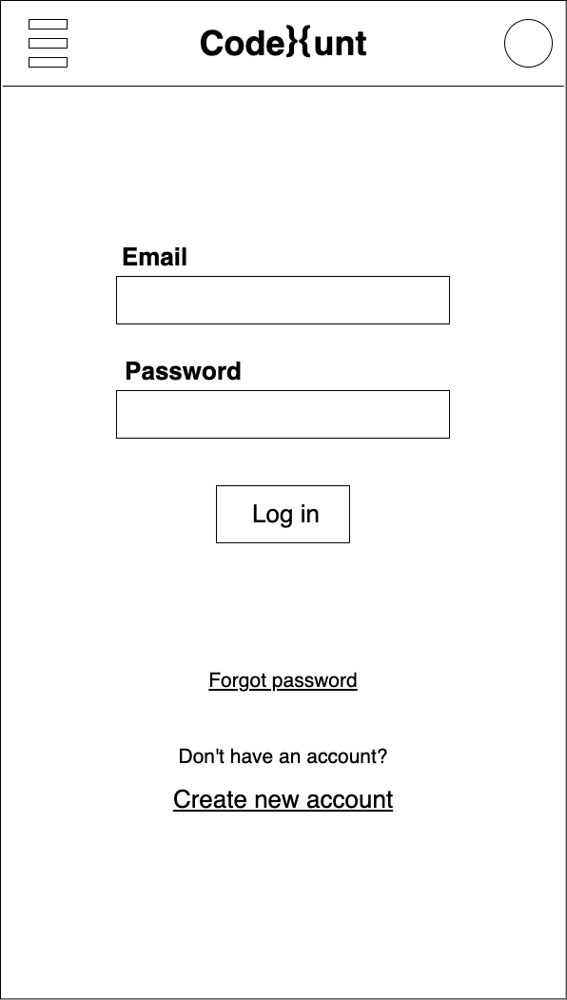
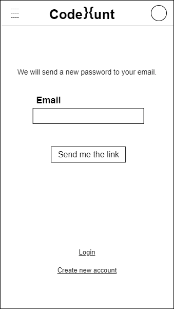
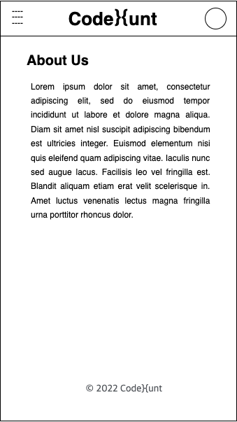

#Prototype
https://d121902.invisionapp.com/console/share/SMBRGPKW5TF

# App map

### Explanation
Each box represents a unique design template. The home page is the list of feature contests by default. The contest view has two viewing option. The count-down view displays the events in future time accenting order. The calendar view displays events in calendar mode. The user and setting page is integrated under one template. The about me view displays information of the team and link to GitHub.

# Wireframes

### Home

### Explanation
The default page showing feature contests.

### Contests (list view)

### Contests (calendar view)

### Explanation
This is a calendar view. At the top are navigation bar, logo, and user profile, which are consistent. The grey boxes represent the time slots in weekly view. The grey box 1-7 represents the days in a week. On the left, a bar indicates the time in each day. 

### User setting

### User sign up

### User log in

### Password reset

### About us

### Navigation bar
